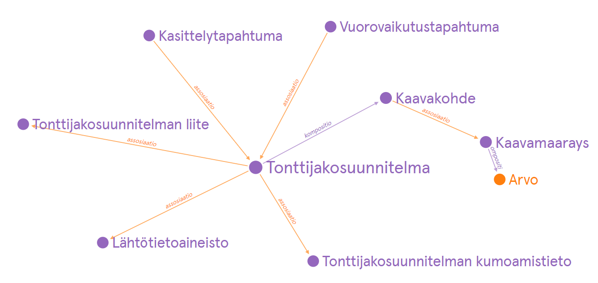

# Käsitemalli
{:.no_toc}

1. 
{:toc}

## Käsitekaavio

(Lataa [käsitekaavio määritelmien kanssa](tjs-kasitemalli.png)) <!-- Tässä vielä väärä kuva toistaiseksi -->

## Käsitteet
### Tontinjakosuunnitelma

<!-- Mikä toi id=concept elementti on? > se viittaa sanastossa id:hen nähtävästi, eli pitää kattoa onko siellä jo olemassa käsitteet ja sitten kattoa niiden id:t-->

Viittaukset toisiin käsitteisiin:
*Tähän kuvataan tontinjakosuunnitelman liitynnät muihin käsitteisiin tai käsitekokonaisuuksiin.*
<!-- * [Lähtötietoaineisto](#lähtötietoaineisto) [0..*]: kaavan laadinnassa hyödynnetty lähtötietoaineisto 
* [Kaavaselostus](#kaavaselostus) [0..1]: kaavan kaavaselostus 
* [Osallistumis- ja arviointisuunnitelma](#osallistumis--ja-arviointisuunnitelma) [0..1]: kaavan osallistumis- ja arviointisuunnitelma
* [Kaavan liite](#kaavan-liite) [0..*]: muu kaavan liite kuin selostus tai osallistumis- ja arviointisuunnitelma
* [Kaavan kumoamistieto](#kaavan-kumoamistieto) [0..1]: minkä kaavan tai sen osat kaava voimaantullessaan kumoaa
* [Kaavakohde](#kaavakohde) [0..*] (kompositio): kaavan liittyä kaavamääräyksiä tai -suosituksia kohdistava paikkatietokohde
* [Kaavamääräys](#kaavamääräys) [0..*] (kompositio): yleismääräys, joka koskee koko kaavan aluetta
* [Kaavasuositus](#kaavasuositus) [0..*] (kompositio): yleissuositus, joka koskee koko kaavan aluetta
-->

### Lähtötietoaineisto


### Liite


### Käsittelytapahtuma


### Kaavan liite


### Käsittelytapahtuma


Viittaukset toisiin käsitteisiin:
* [Kaava](#kaava) [1]: kaavan versio, johon tapahtuma liittyy

### Vuorovaikutustapahtuma


<!--
Viittaukset toisiin käsitteisiin:
* [Kaava](#kaava) [1]: kaavan versio, johon tapahtuma liittyy
-->

### Kumoamistieto


### Kaavakohde


Viittaukset toisiin käsitteisiin:
* [Kaava](#kaava) [1]: kaavan versio, johon kohde sisältyy

### Kaavamääräys


Viittaukset toisiin käsitteisiin:
* [Kaava](#kaava) [1]: kaavan versio, johon määräys sisältyy
* [Arvo](#arvo) [0..*]: tarkentava arvo
* [Lisätieto](#lisätieto) [0..*]: tarkentava tai rajaava lisätieto
* [Kaavakohde](#kaavakohde) [0..*]: kaavakohteiden versio, johon määräyksen vaikutus kohdistuu. Jos ei ole, on kyseessä yleismääräys

### Arvo


### Esitonttitietovarasto


