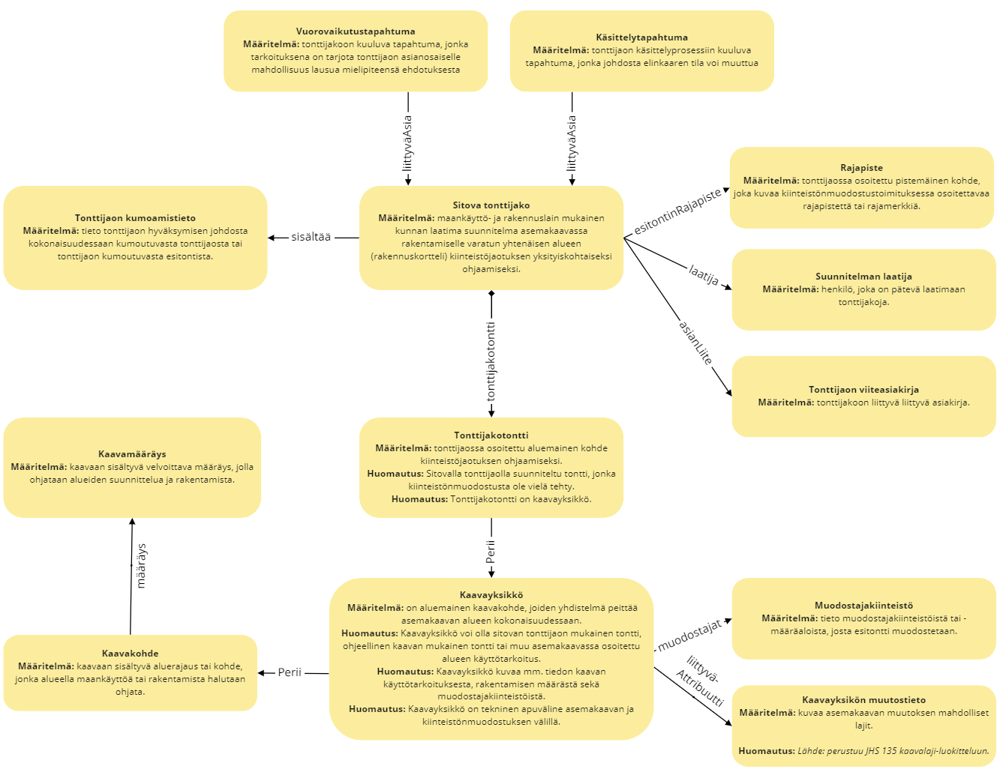

# Käsitemalli
Tällä sivulla esitellyt käsitteet ovat luettavissa yhteentoimivuusalustan [sanasto-työkalussa](https://sanastot.suomi.fi/concepts/43d39261-c7ba-4189-9f5a-9ad263436ee8). Käsitemallin nimiavaruus on [rytj-tjs](http://uri.suomi.fi/terminology/rytj-tjs/).
{:.no_toc}

1. 
{:toc}

## Käsitekaavio

## Käsitteet

### Sitova tonttijako


### Tonttijakotontti


### Rajapiste
    

### Tonttijakosuunnitelman viiteasiakirja


### Käsittelytapahtuma


### Vuorovaikutustapahtuma


### Sitovan tonttijaon kumoutumistieto


### Muodostajakiinteistö


<!-- ### Kaavatilannetieto
 -->

### Sitovan tonttijaon tietovarasto


### Kaavakohde


### Kaavamääräys


### Kaavayksikkö
{% include common/definitionref.html dict="rytj-kaava" dictname="Kaavatietomalli" id="concept-1010" name="kaavayksikkö" def="on aluemainen kaavakohde, joiden yhdistelmä peittää asemakaavan alueen kokonaisuudessaan." note="Kaavayksikkö voi olla sitovan tonttijaon mukainen tontti, ohjeellinen kaavan mukainen tontti tai muu asemakaavassa osoitettu alueen käyttötarkoitus. Kaavayksikkö kuvaa mm. tiedon kaavan käyttötarkoituksesta, rakentamisen määrästä sekä muodostajakiinteistöistä. Kaavayksikkö on tekninen apuväline asemakaavan ja kiinteistönmuodostuksen välillä." %}

### Kaavayksikön muutostieto


<!-- ### Arvo
 -->
